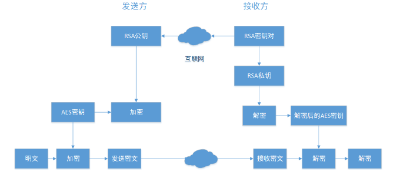

# 加密

## 加密介绍

加密算法分对称加密和非对称算法，其中对称加密算法的加密与解密密钥相同，非对称加密算法的加密密钥与解密密钥不同，此外，还有一类不需要密钥的散列算法。

常见的对称加密算法主要有DES、3DES、AES等，常见的非对称算法主要有RSA、DSA等，散列算法主要有SHA-1、MD5等。

对称算法又可分为两类。一次只对明文中的单个位（有时对字节）运算的算法称为序列算法或序列密码。另一类算法是对明文的一组位进行运算（即运算之前将明文分为若干组，然后分别对每一组进行运算，这些位组称为分组），相应的算法称为分组算法或分组密码。

### AES加密算法

AES加密算法是密码学中的高级加密标准，该加密算法采用对称分组密码体制，密钥长度的最少支持为128、192、256，分组长度128位，算法应易于各种硬件和软件实现。这种加密算法是美国联邦政府采用的区块加密标准，AES标准用来替代原先的DES，已经被多方分析且广为全世界所使用。

A-->(通过K加密)-->B-->(通过K解密)-->A

AES 加解密涉及到的模式（如 CBC、ECB 等）、偏移量和填充等, 需要查阅资料

### RSA加密算法

RSA加密算法是目前最有影响力的公钥加密算法，并且被普遍认为是目前最优秀的公钥方案之一。RSA是第一个能同时用于加密和数宇签名的算法，它能够抵抗到目前为止已知的所有密码攻击，已被ISO推荐为公钥数据加密标准。RSA加密算法基于一个十分简单的数论事实：将两个大素数相乘十分容易，但想要对其乘积进行因式分解却极其困难，因此可以将乘积公开作为加密密钥。

RSA加密是一个非对称的加密方式 即：

1. 公钥加密 私钥解密
2. 私钥加密 公钥解密 使用签名确定是否为该私钥加密

```
名称   密钥长度       运算速度   安全性   资源消耗

AES   128、192、256位   快       高       低
```

```
名称   成熟度   安全性(取决于密钥长度)   运算速度   资源消耗

RSA      高             高              慢        高
```

## 前端 JS 加解密

API
- [crypto-js](https://code.google.com/archive/p/crypto-js/)
- [jsencrypt](http://travistidwell.com/jsencrypt/)

依赖
- [crypto-js](https://www.npmjs.com/package/crypto-js)
- [jsencrypt](https://www.npmjs.com/package/jsencrypt)

```bash
npm i crypto-js -D //AES加密算法
npm i jsencrypt -D //RSA加密算法
```

### 前端 RSA 加解密

[在线生成非对称加密公钥私钥对、在线生成公私钥对、RSA Key pair create、生成RSA密钥对
](http://web.chacuo.net/netrsakeypair)

### 前端 AES 加解密

AES对称加密算法。

AES是基于数据块的加密方式，每次处理的数据是一块（16字节），当数据不是16字节的倍数时自动填充OR手动填充(填充方式取决于使用哪种填充方式)。

支持的模式包括：

- ECB：是一种基础的加密方式，密文被分割成分组长度相等的块（不足补齐），然后单独一个个加密，一个个输出组成密文。
- CBC：是一种循环模式，前一个分组的密文和当前分组的明文异或操作后再加密，这样做的目的是增强破解难度。
- CFB/OFB实际上是一种反馈模式，目的也是增强破解的难度。
- ECB和CBC的加密结果是不一样的，两者的模式不同，而且CBC会在第一个密码块运算时加入一个初始化向量。

补码方式包括：NoPadding，PKCS5Padding，ISO10126Padding；

补码方式的选择依据解码端，例如OC解码需要使用noPadding，crypto-js解码需要使用PKCS5Padding

加密内容必须为16的倍数，在PKCS5Padding、ISO10126Padding填充模式下会自动补位，在noPadding填充模式下需要自己进行补位；

注意：如果结合服务端加密内容使用crypto-js进行解密，无需进行BASE64解码

java 安全性文档
https://docs.oracle.com/javase/6/docs/technotes/guides/security/StandardNames.html#algspec

Oracle JDK 7(经过测试)，AES的默认密码为AES / ECB / PKCS5Padding
Java中AES加密与解密默认使用AES/ECB/PKCS5Padding模式

#### ECB 模式： AES/ECB/PKCS5Padding

查到资料说是 java AES的默认密码为AES/ECB/PKCS5Padding，但是试了不行，写成 AES 不加后面的 ECB/PKCS5Padding 

js 中为：Pkcs7
java 中为： PKCS5Padding

#### CBC 模式： AES/CBC/NOPadding

加解密需要设置 IV

js 中为：ZeroPadding
java 中为：NOPadding

## AES+RSA=数据加密方案

RSA 等非对称加密,字符串过长,很慢不适用; 可参考HTTPS, 生成随机数,通过RSA交换随机数 使用随机数作密码,用AES 加密.



流程：

接收方创建RSA秘钥对，

发送RSA公钥给发送方，自己保留RSA私钥

发送方创建AES密钥，加密待传送的明文，之后用RSA公钥加密该密钥，

RSA公钥加密AES的密钥+AES密钥加密明文的密文----通过Internet发给---->接收方

接收方用RSA私钥解密加密的密钥，之后再用解密后的AES密钥解密数据密文，得到明文。

应用场景：
1. 注册登录流程；
2. 敏感数据：比如身份证号、银行卡号等信息；

## js

具体代码实现见 js-util 内。

RSAUtil.js
```js
import JSEncrypt from 'jsencrypt';

var encryptor = new JSEncrypt();

/**
 * RSA 加密
 * @param {String} data 待加密数据
 * @param {String} publicKey 公钥
 * @returns {String>} 返回加密字符串
 */
function publicEncrypt(data, publicKey) {
  encryptor.setPublicKey(publicKey);
  return encryptor.encrypt(data);
}

/**
 * RSA 解密
 * @param {String} data 待解密数据
 * @param {String} privateKey
 * @returns {String} 返回后解密数据
 */
function privateDecrypt(data, privateKey) {
  encryptor.setPrivateKey(privateKey);
  return encryptor.decrypt(data);
}

export default {
  // RSA 加密
  publicEncrypt: publicEncrypt,
  // RSA 解密
  privateDecrypt: privateDecrypt
};
```

AESUtil
```js
import CryptoJS from 'crypto-js';

/**
 * 生成指定位数字符
 * @param length
 * @returns {String} 返回生成的指定位数字符
 */
function createString(length) {
  var expect = length;
  var str = Math.random().toString(36).substr(2);
  while (str.length < expect) {
    str += Math.random().toString(36).substr(2);
  }
  str = str.substr(0, length);
  return str;
}

/**
 * 生成 AESKEY
 * @returns {String} 返回生成的 32位 AESKEY
 */
function createAesKey() {
  return createString(32);
}

/**
 * 生成 AES IV
 * @returns {String} 返回生成的 16位 AES IV
 */
function createAesIv() {
  return createString(16);
}

/**
 * 转换为字符串
 * @param {*} data
 * @returns {String}
 */
function parseToString(data) {
  var d = '';
  switch (typeof data) {
    case 'string':
      d = data;
      break;
    case 'object':
      d = JSON.stringify(data);
      break;
    default:
      d = data.toString();
  }
  return d;
}

/**
 * AES ECB 加密
 * @param data 待加密字段
 * @param aesKey 加密 key
 * @returns {String} 返回加密字段
 */
function encryptByECB(data, aesKey) {
  var key = CryptoJS.enc.Utf8.parse(aesKey);
  data = parseToString(data);
  var srcs = CryptoJS.enc.Utf8.parse(data);
  var encrypted = CryptoJS.AES.encrypt(srcs, key, {
    mode: CryptoJS.mode.ECB,
    padding: CryptoJS.pad.Pkcs7,
  });
  return encrypted.toString();
}

/**
 * AES ECB 解密
 * @param data 待解密数据
 * @param aesKey 解密 key
 * @returns {String} 返回解密字符串
 */
function decryptByECB(data, aesKey) {
  var key = CryptoJS.enc.Utf8.parse(aesKey);
  var decrypt = CryptoJS.AES.decrypt(data, key, {
    mode: CryptoJS.mode.ECB,
    padding: CryptoJS.pad.Pkcs7,
  });
  return CryptoJS.enc.Utf8.stringify(decrypt).toString();
}

/**
 * AES CBC 加密
 * @param data 待加密字段
 * @param keyStr 加密 key
 * @param aesIv  iv
 * @returns {string} 返回加密字段
 */
function encryptByCBC(data, aesKey, aesIv) {
  var key = CryptoJS.enc.Utf8.parse(aesKey);
  var iv = CryptoJS.enc.Utf8.parse(aesIv);
  data = parseToString(data);
  var srcs = CryptoJS.enc.Utf8.parse(data);
  var encrypted = CryptoJS.AES.encrypt(srcs, key, {
    iv: iv,
    mode: CryptoJS.mode.CBC,
    padding: CryptoJS.pad.ZeroPadding,
  });
  return encrypted.toString();
}

/**
 * AES CBC 解密
 * @param data 待解密数据
 * @param keyStr 解密 key
 * @param aesIv  iv
 * @returns {string} 返回解密字符串
 */
function decryptByCBC(data, aesKey, aesIv) {
  var key = CryptoJS.enc.Utf8.parse(aesKey);
  var iv = CryptoJS.enc.Utf8.parse(aesIv);
  var decrypt = CryptoJS.AES.decrypt(data, key, {
    iv: iv,
    mode: CryptoJS.mode.CBC,
    padding: CryptoJS.pad.ZeroPadding,
  });
  return CryptoJS.enc.Utf8.stringify(decrypt).toString();
}

export default {
    // 生成 AESKEY
    createAesKey: createAesKey,
    // 生成 AES IV
    createAesIv: createAesIv,
    // AES ECB 加密
    encryptByECB: encryptByECB,
    // AES ECB 解密
    decryptByECB: decryptByECB,
    // AES CBC 加密
    encryptByCBC: encryptByCBC,
    // AES CBC 解密
    decryptByCBC: decryptByCBC
};
```

test.js
```js
import RSAUtil from '../util/RSAUtil';
import AESUtil from "../util/AESUtil";

// 请替换 key
var rsaPublicKey = `PUBLIC KEY`;
var rsaPrivateKey = `PRIVATE KEY`;
var data = {
  createTime: Date.now(),
  userInfo: {
      name: 'Zhang San',
      sex: '男',
      National: 'Han',
      age: 18,
      IdentityCardNo: '身份证号码',
      mobilePhone: '139 1949 2019'
  },
  address: {
      state: "BeiJing",
      city: "BeiJing",
      code: "100000",
      address: "xxx"
  }
};

console.log('%c======================= AES + RSA  加解密 =======================', 'color: red;');
console.log("data:", JSON.stringify(data, null, 4));


var aesKey = AESUtil.createAesKey();
var encryptedData = AESUtil.encryptByECB(data, aesKey);
var encryptedAesKey = RSAUtil.publicEncrypt(aesKey, rsaPublicKey);

var encrypted = {
    aesKey,
    encryptedAesKey,
    encryptedData
};

console.log('encrypted:', JSON.stringify(encrypted, null, 4));

var decryptAesKey = RSAUtil.privateDecrypt(encryptedAesKey, rsaPrivateKey);
var decryptedData = AESUtil.decryptByECB(encryptedData, decryptAesKey);

var decrypted = {
    decryptAesKey,
    decryptedData
}
console.log('decrypted:', JSON.stringify(decrypted, null, 4));
```

## nodejs

具体代码实现见 node-util 内。

## java

具体代码实现见 java-util 内。

## 示例

[在线示例：AES、RSA demo](https://shenbao.github.io/rsa_aes_utils/example/rsa-aes-demo/)
